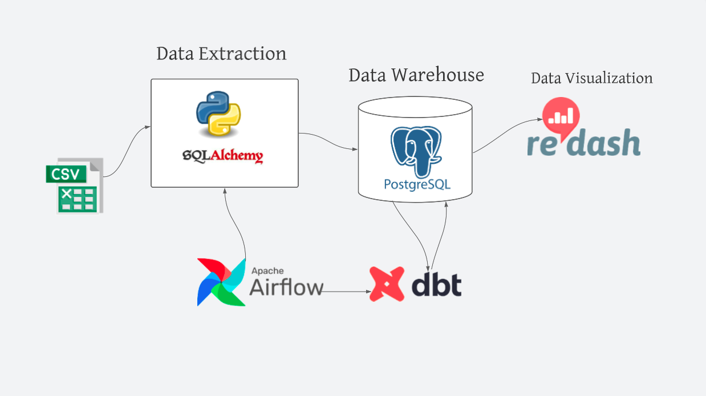

<h1 align="center">Data warehouse tech stack with PostgreSQL, DBT and Airflow
</h1>
<div>
<a href="https://github.com/isaaclucky/data-warehousing/network/members"></a>
<a href="https://github.com/isaaclucky/data-warehousing/pulls"></a>
<a href="https://github.com/isaaclucky/data-warehousing/issues"></a>
<a href="https://github.com/isaaclucky/data-warehousing/graphs/contributors"></a>
<a href="https://github.com/isaaclucky/data-warehousing/blob/main/LICENSE"></a>
</div>


</br>


<p align="center">
  <h3 align="center">Data Engineering Sensor Data</h3>

  <p align="center">
    A fully dockerized ELT pipeline project, using PostgreSQL, dbt, Apache Airflow, and Redash.
    <br />
    <a href="https://traffic-data-docs.herokuapp.com"><strong>Explore the docs »</strong></a>
    <br />
    <br />
  </p>
</p>

## Articles
- [Medium Article](https://medium.com/@isaaclucky88/data-engineering-best-practices-tech-stack-with-postgresql-db-airflow-and-redash-c7d330cfc3b)

## Table of Contents

* [Data Engineering](#Data warehouse tech stack with PostgreSQL, DBT and Airflow)

  - [Project Structure](#project-structure)
    * [data](#data)
    * [models](#models)
    * [notebooks](#notebooks)
    * [DBT](#migrate_to_dbt)
    * [redash](#redash)
    * [logs](#logs)
    * [root folder](#root-folder)
  - [Installation guide](#installation-guide)
  - [Tech Stack](#tech-stack)
  - [Getting Started](#getting-started)
    * [Prerequests](*prerequests)
    * [Installations](*installations)
  - [Tech Stack](#tech-stack)


## Project Structure

### images:

- `images/` the folder where all snapshot for the project are stored.

### logs:

- `logs/` the folder where script logs are stored.

### data:

 - `*.csv.dvc` the folder where the dataset versioned csv files are stored.

### .dvc:
- `.dvc/`: the folder where dvc is configured for data version control.

### .github:

- `.github/`: the folder where github actions and CML workflow is integrated.

### models:
- `models`: the folder where DBT model queries are stored.

### notebooks:

- `eda.ipynb`: a jupyter notebook for exploring the data.


### root folder

- `requirements.txt`: a text file lsiting the projet's dependancies.
- `setup.py`: a configuration file for installing the scripts as a package.
- `README.md`: Markdown text with a brief explanation of the project and the repository structure.
- `Dockerfile`: build users can create an automated build that executes several command-line instructions in a container.
- `docker-compose.yaml`: Integrates the various docker containers and run them in a single environment.

## Installation guide

```bash
git clone https://github.com/isaaclucky/Large_Language_Models.git
cd Large_Language_Models
sudo python3 setup.py install
```
## Tech Stack 
Tech Stack used in this project
* [PostgreSQL](https://dev.PostgreSQL.com/doc/)
* [Apache Airflow](https://airflow.apache.org/docs/apache-airflow/stable/)
* [dbt](https://docs.getdbt.com/)
* [Redash](https://redash.io/help/)


<!-- GETTING STARTED -->
## Getting Started


### Prerequisites

Make sure you have docker installed on local machine.
* Docker
* DockerCompose
  
### Installation

1. Clone the repo
   ```sh
   git clone https://github.com/isaaclucky/data-warehousing.git
   ```
2. Run
   ```sh
    docker-compose build
    docker-compose up
   ```
3. Open Airflow web browser
   ```JS
   Navigate to `http://localhost:8000/` on the browser
   activate and trigger dbt_dag
   activate and trigger migrate
   ```
4. Access the DBT models and docks
   ```sh
    dbt docs serve --port 8081
    Navigate to `http://localhost:8081/` on the browser
   ```
5. Access redash dashboard
   ```sh
   docker-compose up 
   Navigate to `http://localhost:3500/` on the browser
   ```
6. Access your PostgreSQL database using adminar
   ```JS
   Navigate to `http://localhost:8080/` on the browser
   choose PostgreSQL databse
   use `airflow` for username
   use `airflow` for password
   ```


<!-- LICENSE -->
## License

Distributed under the MIT License. See `LICENSE` for more information.


<!-- CONTACT -->
## Contact

Yishak Tadele - [@email](https://www.linkedin.com/in/yishak-tadele/) - tutorialcreation81@gmail.com


<!-- ACKNOWLEDGEMENTS -->
## Acknowledgements
* [10 Academy](https://www.10academy.org/)

